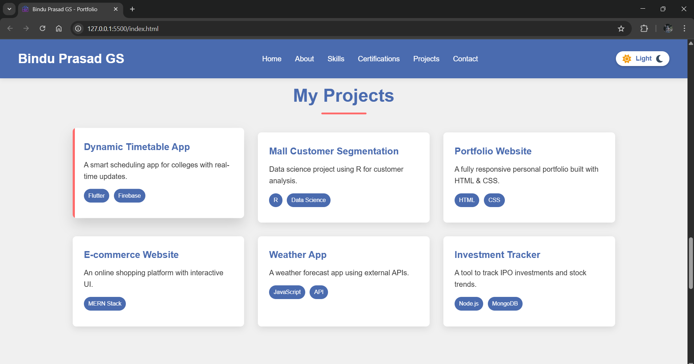

# 🌐 My Portfolio Website

![Portfolio Preview]

## 🚀 About the Project
This is my personal portfolio website showcasing my projects, skills, and experience. Built using **[mention technologies like HTML, CSS.]**, it is designed to be fully responsive and optimized for performance.

## 🎨 Features
- 🖥️ Fully responsive design
- ⚡ Fast and optimized
- 📂 Showcases my best projects
- 📩 Contact form for easy communication

## 📸 Screenshots



## 🚀 Getting Started
To run this project locally, follow these steps:

1. **Clone the repository**
   ```bash
   git clone https://github.com/binduprasad-gs/portfolio-website.git

2. **Navigate into the project folder**
    ```bash
    cd portfolio-website

3. **Open index.html in your browser or use (live server) extention for VScode**
    (No extra setup needed since it’s a static site!)


## 📩 Contact Me

Bindu Prasad GS <br>
📧 **Email:** [binduprasad728@gmail.com](mailto:binduprasad728@gmail.com)  
